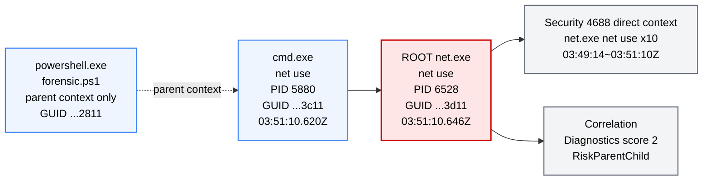

## 제목

`net.exe` 기반 Diagnostics 수준 Sysmon 1 프로세스 실행 및 Direct 4688 보강 근거 분석

## 요약

핵심 계보는 `powershell.exe(forensic.ps1)` → `cmd.exe(net use)` → `net.exe(net use)`이며, Root 프로세스는 `net.exe`, Root ProcessGuid는 `{6f6ee6bf-d2ae-6a0f-3d11-000000000200}`입니다. 다만 `powershell.exe`는 별도 Grandparent Sysmon 1 이벤트가 아니라 `cmd.exe`의 부모 컨텍스트로만 확인되며, Root 이후 DNS, Network, File, Registry, Child Process 후속 행위는 확인되지 않습니다. 

## 핵심

* 탐지 수준: `CorrelationLevel=Diagnostics`, `CorrelationScore=2`입니다. 점수 근거는 `+2 RiskParentChild`입니다. 
* 이상징후: Root 후보는 `net.exe`이며 `RootCandidateReason=RiskImage,RiskParentChild`로 평가되었습니다. 즉, `cmd.exe`가 `net.exe`를 실행한 부모-자식 관계가 주요 이상징후입니다. 
* 계보 판단: `cmd.exe`의 Sysmon 1 이벤트는 확인되지만, `powershell.exe forensic.ps1`는 `[Matched Sysmon 1 Grandparent Process]`가 `(none)`이므로 독립 Grandparent 이벤트로 단정하지 않고 “부모 컨텍스트”로만 표현하는 것이 맞습니다. 
* 후속 증거: `CorrelationSupportingEvidence=DirectSecurity4688Context`이며, Security 4688에서 `net.exe / net use` 실행이 반복적으로 확인됩니다. 다만 Sysmon 22 DNS, Sysmon 3 Network, File/Registry, ADS, Child Process는 모두 `(none)`입니다. 
* 판단: `CriticalEscalator=False`이고 `CriticalEscalatorReasons=None`이므로 Critical로 올릴 근거는 없습니다. 현재 결과는 공격 확정이라기보다 `cmd.exe → net.exe` 실행 관계를 Diagnostics 수준으로 보여 주는 상관 분석 결과입니다. 

## Mermaid

검토 의견으로는, 이번 결과에서 Mermaid는 **후속 공격 행위 확산도**가 아니라 **Root Sysmon 1 프로세스 실행 계보 + Security 4688 보강 근거**를 보여 주는 형태가 가장 적절합니다. 없는 DNS/Network/File/Registry/ADS/WMI/TaskScheduler 노드를 그리지 않은 것도 `PromptMermaid.yaml` 기준에 맞습니다.
