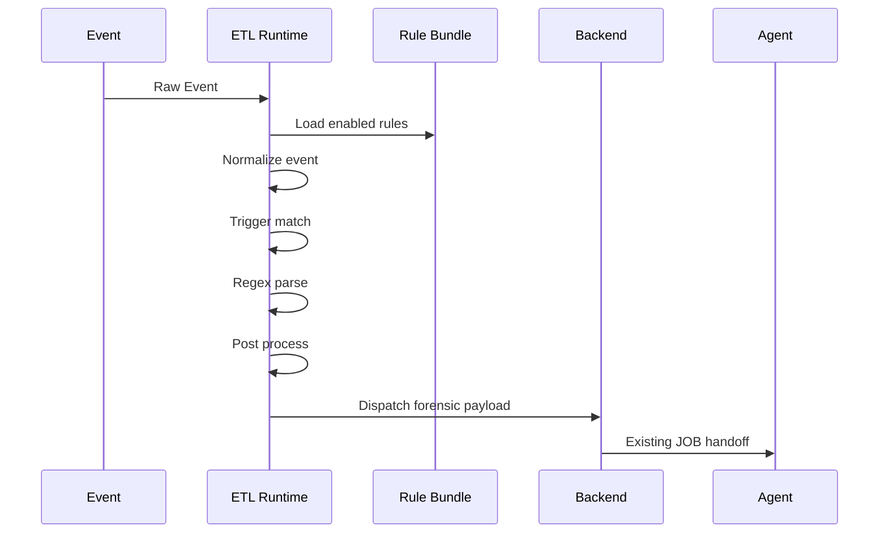
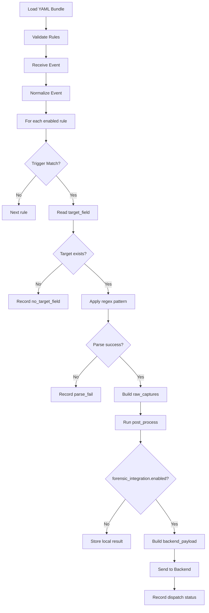

# guide-etl-pseudo.v2.md

## 문서 목적

본 문서는 **Windows LOLBAS ETL Pseudo Code Guide v2** 입니다.
즉, `guide.v2.md` 와 `guide-etl.v2.md` 에 정의된 규격을 기준으로,
ETL 이 어떤 순서로 rule 을 해석하고 Backend 로 전달 payload 를 만드는지 이해하기 위한 **의사코드 문서**입니다.

이 문서는 실제 구현 언어에 종속되지 않으며,
ETL 처리 흐름을 공통된 순서와 자료 구조로 설명하는 데 목적이 있습니다.

## 문서 관계

- `forensic.md`: 전체 구조와 책임 분리의 출발점
- `guide.v2.md`: YAML 규격 정의
- `guide-etl.v2.md`: ETL 과 Backend 의 연계 규칙
- `guide-etl-pseudo.v2.md`: ETL 처리 흐름 의사코드
- `windows-lolbas-rules.v2.yml`: 실제 운영 rule bundle

---

# 1. Mermaid 구성도

## 1-1. Sequence Diagram



## 1-2. Flowchart



---

# 2. ETL 의사코드

## 2-1. Rule Bundle 로딩

```text
function load_rule_bundle(path):
    bundle = read_yaml(path)
    validate bundle.version
    validate bundle.rules exists

    enabled_rules = []

    for each rule in bundle.rules:
        if rule.status != "enabled":
            continue
        validate required fields
        enabled_rules.append(rule)

    return enabled_rules
```

## 2-2. 이벤트 처리 메인 루프

```text
function process_event(event, enabled_rules):
    normalized_event = normalize_event(event)
    results = []

    for each rule in enabled_rules:
        result = apply_rule(normalized_event, rule)
        results.append(result)

    return results
```

## 2-3. Rule 적용 흐름

```text
function apply_rule(event, rule):
    if not match_log_source(event, rule.log_source):
        return status("trigger_miss")

    if not match_trigger(event, rule.trigger):
        return status("trigger_miss")

    target_value = get_target_field(event, rule.target_field)
    if target_value is empty:
        return status("no_target_field")

    captures = regex_match(rule.parser.pattern, target_value)
    if captures is null:
        return status("parse_fail")

    raw_captures = collect_named_groups(captures)
    normalized_fields = run_post_process(raw_captures, rule.post_process)

    dispatch_result = maybe_dispatch_to_backend(
        event,
        rule,
        normalized_fields
    )

    return {
        rule_id: rule.id,
        status: dispatch_result.status,
        raw_captures: raw_captures,
        normalized_fields: normalized_fields,
        backend_payload: dispatch_result.payload
    }
```

---

# 3. Trigger 평가 의사코드

```text
function match_trigger(event, trigger):
    if trigger.image.endswith exists:
        if event.image does not endwith any configured value:
            return false

    if trigger.commandline.contains exists:
        if event.commandline does not contain all required values:
            return false

    if trigger.commandline.regex exists:
        if event.commandline does not match configured regex:
            return false

    return true
```

권장 순서는 다음과 같습니다.

1. `status` 확인
2. `log_source.event_id` 확인
3. `image.endswith` 확인
4. `commandline.contains` 확인
5. `commandline.regex` 확인
6. parser 적용

---

# 4. Post Process 의사코드

```text
function run_post_process(raw_captures, post_process_list):
    fields = copy(raw_captures)

    for each step in post_process_list:
        if step starts with "coalesce":
            apply_coalesce(fields, step)
        else if step starts with "trim":
            apply_trim(fields, step)
        else if step starts with "normalize_windows_path":
            apply_normalize_windows_path(fields, step)
        else if step starts with "detect_remote_url":
            apply_detect_remote_url(fields, step)
        else if step starts with "detect_ads":
            apply_detect_ads(fields, step)
        else if step starts with "detect_script_extension":
            apply_detect_script_extension(fields, step)
        else if step starts with "detect_script_scheme":
            apply_detect_script_scheme(fields, step)
        else if step starts with "detect_sct":
            apply_detect_sct(fields, step)
        else:
            record_warning("unknown_post_process_step")

    return fields
```

---

# 5. Backend 전달 의사코드

핵심은 `forensic_integration` 이 켜진 rule 만 Backend 로 전달한다는 점입니다.

```text
function maybe_dispatch_to_backend(event, rule, normalized_fields):
    if rule.forensic_integration.enabled is not true:
        return {
            status: "matched_local_only",
            payload: null
        }

    payload = {
        rule_id: rule.id,
        forensic_code: rule.forensic_integration.forensic_code,
        extracted_values: select_fields(
            normalized_fields,
            rule.forensic_integration.payload_fields
        ),
        source_event: {
            event_id: event.event_id,
            timestamp: event.timestamp,
            computer: event.computer,
            image: event.image,
            commandline: event.commandline
        }
    }

    send_result = send_to_backend(payload)

    if send_result.success:
        return {
            status: "backend_dispatch_ready",
            payload: payload
        }

    return {
        status: "backend_dispatch_fail",
        payload: payload
    }
```

---

# 6. 자료 구조 예시

## 6-1. raw_captures

```json
{
  "image_quoted": "C:\\Windows\\System32\\bitsadmin.exe",
  "job_name_q": "mydownload",
  "remote_src_q": "http://example.com/download.log:evil.vbs",
  "local_dst_q": "C:\\temp\\local.vbs"
}
```

## 6-2. normalized_fields

```json
{
  "image": "C:\\Windows\\System32\\bitsadmin.exe",
  "job_name": "mydownload",
  "remote_src": "http://example.com/download.log:evil.vbs",
  "local_dst": "C:\\temp\\local.vbs",
  "remote_src_is_remote_url": true,
  "remote_src_has_ads": true,
  "local_dst_extension": ".vbs"
}
```

## 6-3. backend_payload

```json
{
  "rule_id": "LOLBAS_BITSADMIN_TRANSFER_V2",
  "forensic_code": "WIN-LOLBAS-BITSADMIN-TRANSFER",
  "extracted_values": {
    "image": "C:\\Windows\\System32\\bitsadmin.exe",
    "job_name": "mydownload",
    "remote_src": "http://example.com/download.log:evil.vbs",
    "local_dst": "C:\\temp\\local.vbs"
  }
}
```

---

# 7. 운영 포인트

## 7-1. Agent 는 변경하지 않습니다

의사코드의 목적은 ETL 이 어느 수준까지 처리해야 하는지를 보여주는 것입니다.
이 구조에서는 Agent 가 YAML 이나 regex 를 알 필요가 없습니다.

## 7-2. ETL 은 해석기 역할에 집중합니다

ETL 은 rule engine 역할을 하되,
정책 내용을 하드코딩하는 것이 아니라 YAML bundle 을 해석하는 역할에 집중합니다.

## 7-3. 실제 구현은 언어별로 달라질 수 있습니다

이 문서의 pseudocode 는 Python, Java, Go, Logstash filter, Spark ETL, Fluent Bit processor 등으로 옮겨도 같은 순서를 유지하는 것을 목표로 합니다.

---

# 8. 결론

이 문서에서 정리하는 핵심은 아래와 같습니다.

1. ETL 은 rule bundle 을 로드합니다.
2. ETL 은 trigger 와 parser 를 적용해 추출값을 만듭니다.
3. `forensic_integration` 이 켜진 rule 은 Backend 로 payload 를 전달합니다.
4. Backend 는 JOB 코드로 변환해 Agent 로 넘깁니다.
5. Agent 구조는 변경하지 않습니다.
