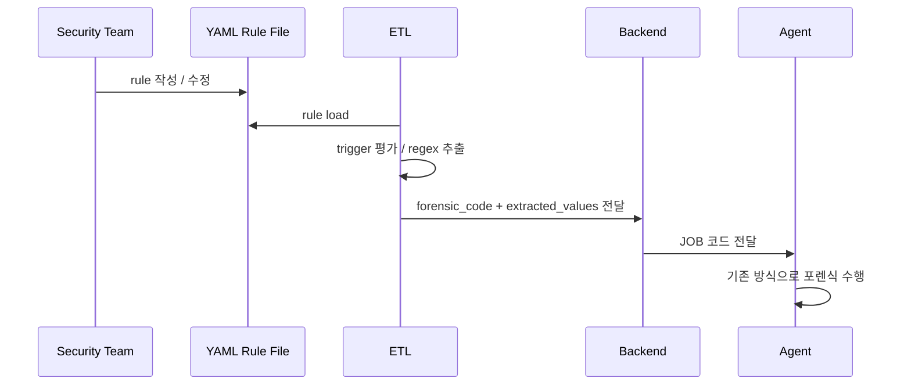
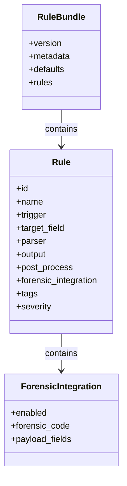

# guide.v2.md

## 문서 목적

본 문서는 **Windows LOLBAS YAML Rule Specification v2** 입니다.
즉, 보안 담당자가 관리하는 YAML 룰 파일을 어떤 형식과 기준으로 작성할 것인지를 정의하는 **YAML 규격 문서**입니다.

이 문서의 초점은 구현이 아니라 선언입니다.
따라서 이 문서는 아래를 정의합니다.

- rule 공통 스키마
- trigger 작성 기준
- parser pattern 작성 기준
- output / post_process 작성 기준
- `forensic_integration` 작성 기준
- 실제 운영 YAML 파일과의 연결 기준

## 문서 관계

- `forensic.md`: 전체 구조와 책임 분리의 출발점
- `guide.v2.md`: YAML 규격과 작성 기준
- `guide-etl.v2.md`: ETL 과 Backend 의 연계 기준
- `guide-etl-pseudo.v2.md`: ETL 의사코드 예시
- `windows-lolbas-rules.v2.yml`: 실제 운영 YAML 룰 파일

즉, 이 문서는 **보안 담당자가 무엇을 YAML 로 관리할 것인가**를 정의하며,
ETL 이 이를 어떻게 해석하는지는 `guide-etl.v2.md` 에서 다룹니다.

---

# 1. 핵심 원칙

## 1-1. 보안 담당자는 YAML 만 관리합니다

보안 담당자는 rule 의 선언형 정의만 관리합니다.
즉, 아래를 YAML 로 작성합니다.

- 어떤 LOLBAS 를 볼 것인가
- 어떤 이벤트를 트리거로 볼 것인가
- 어떤 필드를 파싱할 것인가
- 어떤 값을 추출할 것인가
- 어떤 `forensic_code` 로 연계할 것인가

## 1-2. 추출은 ETL 이 수행합니다

YAML 은 rule 을 정의할 뿐이며,
실제 트리거 평가와 정규식 추출은 **ETL** 이 수행합니다.

## 1-3. Agent 구조는 변경하지 않습니다

이 구조의 목적은 Agent 에 탐지/추출 로직을 넣지 않는 것입니다.
ETL 이 YAML 에 따라 추출한 결과를 Backend 로 전달하고,
Backend 는 그 값을 JOB 코드에 실어 Agent 로 보내므로,
Agent 는 기존 포렌식 수행 구조를 그대로 유지합니다.

---

# 2. Mermaid 구성도

## 2-1. Sequence Diagram



## 2-2. Class Diagram



---

# 3. YAML 공통 스키마 v2

```yaml
version: 2

metadata:
  name: windows-lolbas-commandline-parser
  description: Operational LOLBAS parsing rules for Windows CommandLine with ETL forensic integration
  owner: security-team
  target_platform: windows

defaults:
  target_field: CommandLine
  parser_type: regex
  case_insensitive: true

rules: []
```

---

# 4. Rule 공통 필드 정의

## 4-1. 기본 메타 필드

```yaml
- id: LOLBAS_BITSADMIN_TRANSFER_V2
  name: bitsadmin transfer extract v2
  status: enabled
  description: Extract job name, remote source, and local destination from bitsadmin /transfer command line
  lolbas: bitsadmin
  category: file_download
```

| 필드 | 설명 |
|---|---|
| `id` | 룰 고유 ID |
| `name` | 룰명 |
| `status` | `enabled` / `disabled` |
| `description` | 룰 설명 |
| `lolbas` | LOLBAS 이름 |
| `category` | 행위 분류 |

## 4-2. 로그 소스

```yaml
log_source:
  product: windows
  service: security
  event_id:
    - 4688
    - 1
```

## 4-3. 트리거

```yaml
trigger:
  image:
    endswith:
      - '\bitsadmin.exe'
  commandline:
    contains:
      - '/transfer'
```

지원 권장 항목:

- `image.endswith`
- `commandline.contains`
- `commandline.regex`

## 4-4. 파싱 대상

```yaml
target_field: CommandLine
```

## 4-5. 파서

```yaml
parser:
  type: regex
  pattern: '...'
```

## 4-6. 출력 필드

```yaml
output:
  - remote_src
  - local_dst
```

## 4-7. 후처리

```yaml
post_process:
  - coalesce:remote_src=remote_src_q,remote_src
  - normalize_windows_path:local_dst
  - detect_remote_url:remote_src
```

## 4-8. 포렌식 연계 정의

이 구조에서 중요한 신규 필드는 `forensic_integration` 입니다.

```yaml
forensic_integration:
  enabled: true
  forensic_code: WIN-LOLBAS-BITSADMIN-TRANSFER
  payload_fields:
    - image
    - job_name
    - remote_src
    - local_dst
```

| 필드 | 설명 |
|---|---|
| `enabled` | 이 rule 이 Backend 포렌식 연계 대상인지 여부 |
| `forensic_code` | Backend 와 Agent 가 참조할 포렌식 코드 |
| `payload_fields` | ETL 이 Backend 로 전달해야 하는 최종 필드 목록 |

이 필드를 통해 ETL 은 **rule match + 추출 성공 시 어떤 포렌식 코드와 어떤 값을 전달할지**를 알 수 있습니다.

---

# 5. quoted / unquoted Windows CommandLine 대응 기준

실제 Windows `CommandLine` 은 아래와 같이 다양합니다.

```text
bitsadmin /transfer myjob http://example.com/a.exe C:\temp\a.exe
```

```text
bitsadmin /transfer "myjob" "http://example.com/a.exe" "C:\temp\a.exe"
```

```text
"C:\Windows\System32\bitsadmin.exe" /transfer "myjob" "http://example.com/a.exe" "C:\temp\a.exe"
```

따라서 YAML 의 regex pattern 은 quoted / unquoted 인자를 모두 수용해야 합니다.

### 실행 이미지 예시

```regex
(?:
  "(?<image_quoted>[^"]*bitsadmin(?:\.exe)?)"
  |
  (?<image_plain>\S*bitsadmin(?:\.exe)?)
)
```

### 일반 인자 예시

```regex
(?:
  "(?<field_q>[^"]+)"
  |
  (?<field>\S+)
)
```

### 마지막 경로 인자 예시

마지막 경로 인자는 공백 포함 가능성을 고려해 quoted 우선으로 처리합니다.

---

# 6. 운영용 rule 작성 예시

아래는 `bitsadmin` 예시입니다.

```yaml
- id: LOLBAS_BITSADMIN_TRANSFER_V2
  name: bitsadmin transfer extract v2
  status: enabled
  description: Extract job name, remote source, and local destination from bitsadmin /transfer command line with quoted argument support
  lolbas: bitsadmin
  category: file_download

  log_source:
    product: windows
    service: security
    event_id:
      - 4688
      - 1

  trigger:
    image:
      endswith:
        - '\bitsadmin.exe'
    commandline:
      contains:
        - '/transfer'

  target_field: CommandLine

  parser:
    type: regex
    pattern: '(?ix)
      ^\s*
      (?:
        "(?<image_quoted>[^"]*bitsadmin(?:\.exe)?)"
        |
        (?<image_plain>\S*bitsadmin(?:\.exe)?)
      )?
      \s*
      /transfer
      \s+
      (?:
        "(?<job_name_q>[^"]+)"
        |
        (?<job_name>\S+)
      )
      \s+
      (?:
        "(?<remote_src_q>[^"]+)"
        |
        (?<remote_src>\S+)
      )
      \s+
      (?:
        "(?<local_dst_q>[^"]+)"
        |
        (?<local_dst>.+?)
      )
      \s*$
    '

  output:
    - image_quoted
    - image_plain
    - job_name_q
    - job_name
    - remote_src_q
    - remote_src
    - local_dst_q
    - local_dst

  post_process:
    - coalesce:image=image_quoted,image_plain
    - coalesce:job_name=job_name_q,job_name
    - coalesce:remote_src=remote_src_q,remote_src
    - coalesce:local_dst=local_dst_q,local_dst
    - normalize_windows_path:local_dst
    - detect_remote_url:remote_src
    - detect_ads:remote_src
    - detect_script_extension:local_dst

  forensic_integration:
    enabled: true
    forensic_code: WIN-LOLBAS-BITSADMIN-TRANSFER
    payload_fields:
      - image
      - job_name
      - remote_src
      - local_dst

  tags:
    - lolbas
    - bitsadmin
    - transfer
    - download

  severity: high
```

---

# 7. 실제 운영 파일과의 연결

`guide.v2.md` 는 규격 문서이며,
실제 운영에 사용하는 룰 파일은 별도 파일인 아래를 기준으로 관리합니다.

```text
windows-lolbas-rules.v2.yml
```

즉,
- `guide.v2.md` 는 작성 기준과 스키마를 설명하고
- `windows-lolbas-rules.v2.yml` 는 실제 운영 데이터를 담습니다.

이 분리를 통해 문서는 설명용으로 유지하고,
YAML 파일은 배포/버전관리/테스트의 기준 파일로 사용할 수 있습니다.

---

# 8. 권장 운영 원칙

## 8-1. rule 은 선언형으로 유지합니다

YAML 에 계산 로직을 과도하게 넣지 않고,
아래만 선언합니다.

- trigger
- parser.pattern
- output
- post_process
- forensic_integration

## 8-2. 포렌식 코드와 전달 필드를 명시합니다

각 rule 은 Backend 로 넘길 `forensic_code` 와 `payload_fields` 를 명시해야 합니다.
이것이 있어야 ETL 이 어떤 데이터를 Backend 로 넘겨야 하는지 명확해집니다.

## 8-3. 문서와 운영 파일을 분리합니다

- 설명: `guide.v2.md`
- 실제 rule bundle: `windows-lolbas-rules.v2.yml`

---

# 9. 결론

이 문서는 **보안 담당자가 YAML 로 무엇을 관리할 것인가**를 정의하는 문서입니다.

핵심은 다음과 같습니다.

1. YAML 은 선언형 rule 정의만 담습니다.
2. 추출은 ETL 이 수행합니다.
3. `forensic_integration` 으로 Backend 연계 기준을 정의합니다.
4. Backend 는 이를 JOB 코드에 올리고, Agent 는 기존 구조를 유지합니다.
5. 실제 운영 규칙은 `windows-lolbas-rules.v2.yml` 파일에서 관리합니다.
